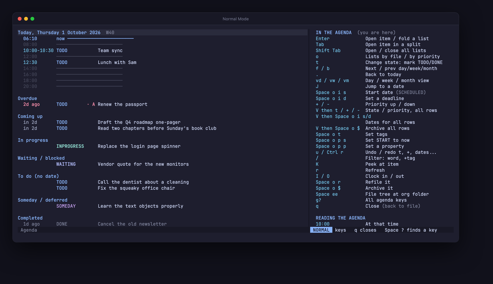
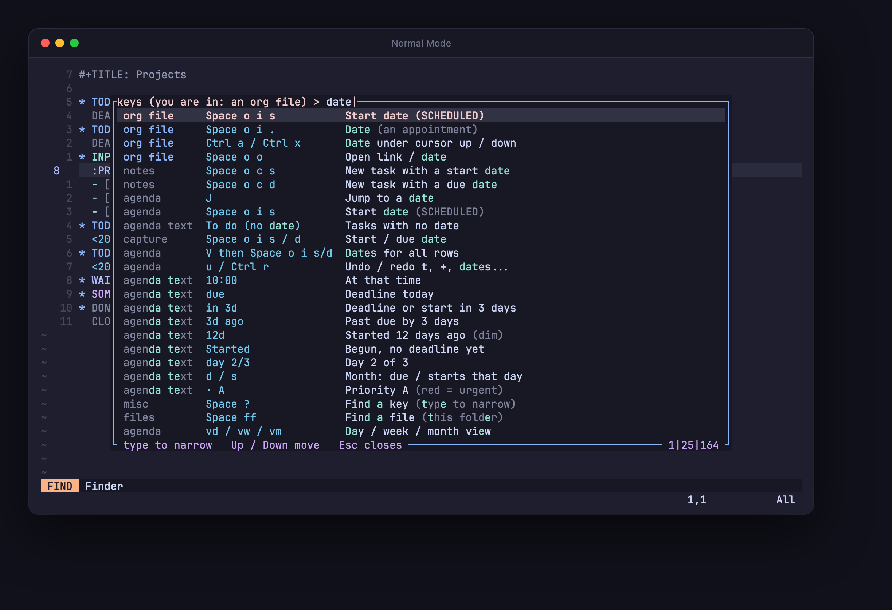

# Normal Mode

<p align="center">
  
</p>

A Neovim kit for people who have been living in insert mode: an org-mode
agenda for your day, notes in plain text files, and a cheat sheet that finds
any key. Made for someone coming from VS Code who wants to learn Vim without
first assembling a config.

Everything is in this folder, already unpacked: Neovim 0.12.5 itself, the
config, the plugins and a prebuilt org parser. Nothing gets installed, so it
runs on a locked-down machine: no admin, no Homebrew, no PATH edits, no
network.

## Setup

**Windows**: Code, Download ZIP, extract it, double-click `nvim.cmd`.

**Mac**: Code, Download ZIP, extract it. The first time, open Terminal, type
`sh ` (with the space), drag `nvim.command` into the window and press
Return. After that, double-click `nvim.command`. A downloaded copy is
quarantined, so Finder will not open `nvim.command` until it has run once;
that first run clears the mark from this folder and changes nothing else.

A launch with no file opens your day: today with its hours, then Overdue,
Coming up, Started, In progress, Waiting / blocked, To do (no date),
Someday / deferred and Completed. Your org files live in
`C:\Users\<you>\org` on Windows and `~/org` on a Mac; the folder and an
`inbox.org` are created on the first launch. Every `.org` file in it feeds
the agenda. Files save themselves: when you leave insert mode, and a moment
after any change.

## Keys

`Space ?` is the key to learn first: it lists every key in plain English
and narrows as you type. `Space K` keeps the same list open at the side.

<p align="center">
  
</p>

Enough for day one:

| | |
|---|---|
| `Space o a d` | your day (`a` the week, `t` every open task, `c` what you finished) |
| `Space o c t` | capture a task into the inbox (`s` with a start date, `d` with a due date) |
| `cit` | change a task's state (TODO, INPROGRESS, DONE, ...) |
| `Space o i s` / `Space o i d` | give the task a start date / a deadline |
| `Space ee` / `Space ff` / `Space fo` | file tree / find a file / find an org file |
| `Alt Up` / `Alt Down` | move a line, a task or a list item |
| `Space x` | tick a checkbox (a plain item gets one) |
| `Tab` | fold or unfold a task; on a drawer, open or close it |
| `Esc` then `:q` and Enter | leave |

A key that waits for more never times out: after `Space`, a small window
lists what can come next. The bar at the bottom names the mode in words.

## Terminals

Use Windows Terminal on Windows. On a Mac, Apple's Terminal has the colors
from macOS 26 on; for `Alt Up` / `Alt Down` it needs Settings, Profiles,
Keyboard, "Use Option as Meta key". In iTerm2 set the Option key to Esc+,
in Ghostty `macos-option-as-alt = true`.

## Intel Macs

The bundled Mac build is for Apple Silicon. On an Intel Mac, download
`nvim-macos-x86_64.tar.gz` from Neovim's v0.12.5 release, double-click it
to unpack, and move the `nvim-macos-x86_64` folder next to `nvim.command`.
The launcher picks it up; the org parser already covers both.

## What is inside

| | |
|---|---|
| `nvim.cmd`, `nvim.command` | the launchers: find Neovim, start it with `nvim/` as the config. They never unpack, move or delete anything; the quarantine mark above is the one thing `nvim.command` changes |
| `nvim-win64/`, `nvim-macos-arm64/` | the official Neovim v0.12.5 releases, unpacked as shipped |
| `nvim/init.lua` | settings and keys |
| `nvim/lua/kit/` | the agenda look, the cheat sheet, the mode bar, the key hints |
| `nvim/pack/kit/start/` | the plugins, vendored: nvim-orgmode, catppuccin, nvim-tree, mini.pick, mini.clue, mini.files |
| `nvim/pack/kit/start/orgmode/parser/org.so` | the org parser for Windows (tree-sitter-org 2.0.4, x64) |
| `nvim/org-parser/org-macos.so` | the same parser for macOS, Apple Silicon and Intel in one file, macOS 11 and up |

If something did not load, startup says so in lines starting `nvim kit:`.
Silence means everything loaded. If the machine refuses to run the bundled
Neovim at all (a policy on what may run), the window says so; nothing in
the kit gets around that.

## Updating a piece

Pinned versions: Neovim v0.12.5, nvim-orgmode `d9cd82d`, catppuccin
`edefef7`, nvim-tree `478c69c`, mini.pick `360c1bb`, mini.clue `1c136d6`,
mini.files `f1cfece`, tree-sitter-org `2.0.4`. A plugin is a plain checkout
with `.git`, CI and tests removed and help tags built. The Neovim archives,
as downloaded from the release page: `nvim-win64.zip` sha256
`de8625ba8cf65ebf40eb80a388ba1ec8e9c15b30218821e2c639119b05920de1`,
`nvim-macos-arm64.tar.gz` sha256
`65fb000099e47ca1b762584c484cc833f40e30851a0ec450d4174e16317c1f9b`.

The parser has to match the version orgmode asks for
(`orgmode/lua/orgmode/utils/treesitter/install.lua`, `required_version`);
`orgmode/.org-ts-lock.json` records it. Build it from that tag of
https://github.com/nvim-orgmode/tree-sitter-org with, on a Mac:

```sh
cc -arch arm64 -arch x86_64 -mmacosx-version-min=11.0 -o org-macos.so -I./src src/parser.c src/scanner.c -Os -std=c11 -bundle
zig cc -target x86_64-windows-gnu -shared -Os -std=c11 -I src src/parser.c src/scanner.c -o org.so
```

`-mmacosx-version-min` matters: without it the file only loads on the macOS
it was built on or newer.

## License

MIT. Neovim has its own license (Apache 2.0, with parts under Vim's
license), and each vendored plugin keeps its license file in its folder.
